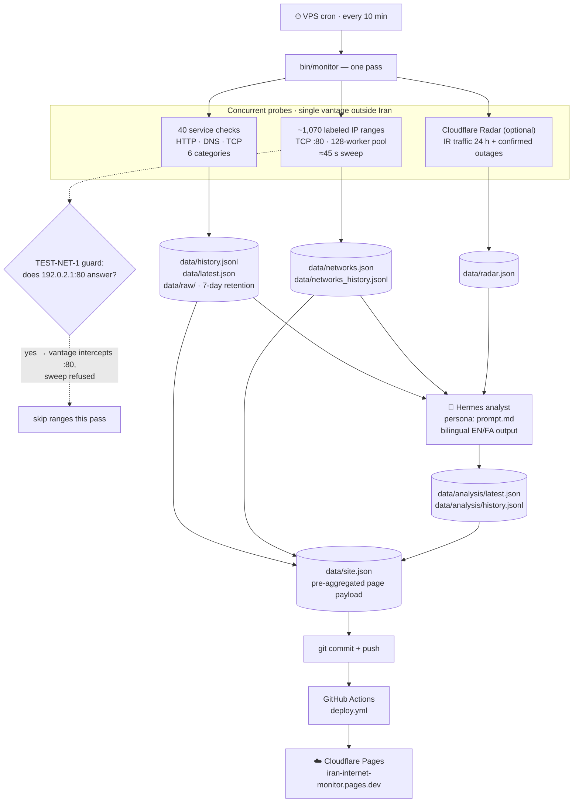

# IranNet Monitor

**Independent, open-data observatory of Iran's internet — connectivity, censorship, and circumvention — probed every 10 minutes from outside Iran, with an LLM analyst reading every pass and a bilingual (English / فارسی) live status page.**

[](https://iran-internet-monitor.pages.dev)
[](go.mod)
[](data/)

Every pass is a git commit: the full raw history of Iran's reachability lives in this repository, open for researchers, journalists, and tooling (`jq`, notebooks, LLMs) to consume directly.

---

## Architecture



One pass = **probe → store → analyze → publish**, all inside a single Go binary designed for a 1 GB VPS: fixed worker pools, flat memory, and every external dependency (Radar, the LLM, git push) best-effort — a dead dependency never loses a pass.

## What it monitors

**40 endpoints across 6 categories:**

| Category | Endpoints |
|----------|-----------|
| ISP endpoints | TIC gateways (2.187.1.1, 78.38.112.1), Irancell, Asiatech, Shatel, Respina, Mobinnet |
| DNS resolvers | Shecan (178.22.122.100), TIC (217.218.155.155), Electro (78.157.42.100) |
| Domestic services | Digikala, Snapp, Tapsi, Aparat, Filimo, CafeBazaar, Rubika, Eitaa, Balad, Saman Bank, Shaparak, IRNA |
| Foreign platforms | Google, Cloudflare, Telegram, WhatsApp, Instagram, YouTube, Wikipedia, GitHub |
| Circumvention | Tor Project, Tor BridgeDB, Snowflake broker, Psiphon |
| Observatories | IODA, OONI, RIPEstat, Tor Metrics |

**Plus ~1,070 labeled Iranian IP allocations** (`ir.csv`): one representative address per registered range, TCP-probed on port 80 each pass and aggregated per operator — this is what lets the analysis tell an ISP-specific shutdown from a national one.

**Plus Cloudflare Radar** (optional): Iran's normalized traffic timeseries and Cloudflare-confirmed outage events — the outside-in view that corroborates or contradicts the probes.

> **Vantage honesty:** all probes originate from a single VPS *outside* Iran. They measure reachability from the outside, not the inside-Iran user experience. Before every range sweep the monitor dials TEST-NET-1 (`192.0.2.1:80`), an address no real network routes; if it "connects", something on the path intercepts TCP :80 (VPN, transparent proxy) and the sweep is refused rather than publishing fake reachability.

## Quick start

```sh
git clone https://github.com/Danialsamadi/iran-internet-monitor.git
cd iran-internet-monitor
make build
make run-once            # smoke test: probes only — no LLM, no git
make run                 # one full pass
make cron                # prints the crontab line for this checkout
```

The VPS needs a git identity with push access (deploy key or PAT):

```sh
git config user.name  "irannet-monitor"
git config user.email "monitor@users.noreply.github.com"
```

Optional integrations, via environment:

| Variable | Enables |
|----------|---------|
| `CLOUDFLARE_API_TOKEN` | Radar signals (free token, `Account → Radar → Read` scope). Unset = silent no-op. |

Small-VPS notes: run cron with `-no-llm` if the analyst runs elsewhere, and keep the checkout shallow (`git clone --depth 1` + a weekly `git fetch --depth 1 && git gc --prune=now`) so pass commits don't eat the disk.

## Configuration

### Adding a service

Append one entry to the right category in `config.yaml`:

```yaml
- id: my-service          # unique, stable — keys the history archive
  name: My Service
  name_fa: سرویس من       # optional, for the Persian page
  type: http              # http | dns | tcp
  target: https://example.ir
```

That's the whole change — checker, storage, analysis and the page all pick it up on the next pass. `dns` checks take a resolver in `target` (`ip:53`) and an optional `query:` domain; `tcp` checks take `host:port`.

### Labeled IP ranges

`ir.csv` holds registered Iranian allocations as `start_ip,end_ip,count,date,organization`. Swap or extend the file and the next pass picks it up (`ip_ranges_csv` in `config.yaml`). The parser is deliberately forgiving of the upstream data's quirks — stray quotes and unquoted commas in organization names.

## The analyst

Every pass is read by **Hermes** with the persona in `prompt.md` — an analyst that encodes Iran's censorship architecture in depth:

- **Network topology:** TIC/DCI international gateways (AS12880, AS49666), LCT where 70–80 % of international traffic terminates, NIN/SHOMA domestic intranet, provincial IXPs (TBZIX, SHIX, AHWIX)
- **DPI mechanics:** SNI filtering, DNS poisoning (10.10.34.34 triplet injection), HTTP Host inspection, TCP RST injection, behavioral fingerprinting
- **Protocol whitelisting:** default-deny — only DNS/HTTP/HTTPS pass (Bock et al., USENIX FOCI '20)
- **Shutdown evolution:** blunt BGP withdrawal (2019) → hybrid cellular curfews (2022) → stealth blackout with BGP intact (June 2025) → tiered "blocked-by-default" whitelisting (Jan 2026)
- **Tiered access & surveillance:** SCN white-SIMs, Pro Internet SIM, SHAHKAR/HAMTA identity enforcement, SIAM intercept
- **Circumvention:** Tor (Snowflake, WebTunnel), VLESS/Trojan-in-TLS, Psiphon, domain-fronting status

### Output schema

Structured JSON, every field in parallel English and Persian (`*_fa`):

| Key | Meaning |
|-----|---------|
| `overall_status` | `operational` / `degraded` / `partial_outage` / `major_outage` |
| `severity` | `none` / `minor` / `major` / `critical` |
| `suspected_causes` | most likely first |
| `affected_services` | impaired names/groups |
| `public_summary` | 2–3 sentences shown on the status page |
| `insight` | one analytical sentence (the italic quote on the page) |
| `recommendation` | one concrete next step |

Saved to `data/analysis/latest.json`, archived in `data/analysis/history.jsonl`, embedded in `site.json`.

### Changing the analysis

| To change… | Edit |
|------------|------|
| Analyst persona / instructions | `prompt.md` (read fresh every pass, no rebuild) |
| Persian terminology & style | `docs/analysis-template-fa.md` (60+ mapped terms, verb cycling, formal register) |
| Persian glossary | `docs/persian-glossary.md` |
| What data the model sees | `buildPrompt()` in `internal/analyzer/analyzer.go` |
| Output schema | the `Analysis` struct in the same file (the page reads the same keys) |

## The status page

`web/index.html` — a single self-contained file, no build step, broadsheet-newspaper design:

- **Bilingual:** full RTL layout in Persian — Vazirmatn type, Persian digits (`۰۱۲۳۴۵۶۷۸۹`), all `*_fa` analysis fields
- **Dark mode:** follows system preference, ☀︎/☾ toggle, applied before first paint
- **Responsive:** phone-first breakpoints, touch-size navigation, horizontally scrolling tables
- **Pages:** Overview · Endpoints · Networks · History · Analysis · About (the About page documents all cross-referenced research sources bilingually)

### Deploy (Cloudflare Pages)

1. Create a Pages project named `iran-internet-monitor` (Direct Upload).
2. Add repo secrets `CLOUDFLARE_API_TOKEN` (Pages:Edit) and `CLOUDFLARE_ACCOUNT_ID`.
3. Every data push triggers `.github/workflows/deploy.yml`, which assembles `web/` + the JSON data into `dist/` and deploys.

## Data formats

`data/history.jsonl` — one self-describing line per check, ideal for `jq` and LLMs:

```json
{"ts":"2026-07-26T10:55:01Z","service_id":"telegram-web","name":"Telegram Web","category":"Foreign platforms","type":"http","target":"https://web.telegram.org","status":"up","latency_ms":412,"http_status":200}
```

Statuses: `up` · `degraded` (slower than `check.degraded_ms`) · `down`.
Overall: `operational` → `degraded` → `partial_outage` (≥ 10 % down) → `major_outage` (≥ ⅓ down).

## Repository layout

```
cmd/monitor/        entrypoint — one pass: probe → store → analyze → commit
internal/checker/   concurrent HTTP/DNS/TCP checks + the IP-range sweep
internal/radar/     Cloudflare Radar client (IR traffic + confirmed outages)
internal/analyzer/  LLM analysis: prompt building, validation, archiving
internal/storage/   JSONL/JSON persistence, 24 h / 30-day aggregation, site.json
internal/git/       stage data/, commit with pass summary, push
internal/config/    config.yaml + ir.csv loading
web/index.html      the entire status page
data/               everything the monitor writes — committed every pass
prompt.md           the analyst persona (single source of truth)
docs/               Persian glossary + analysis style guide
config.yaml         the single place services are defined
ir.csv              labeled Iranian IP allocations
```

## Research sources cross-referenced in analysis

| Source | Coverage |
|--------|----------|
| IODA (Georgia Tech) | Comparative shutdown analysis 2019 / 2022 / 2025 / 2026 |
| Filterwatch | Ongoing Persian-language monitoring, tiered access, stealth blackouts |
| OONI | DPI blocking and protocol-whitelisting measurements |
| Bock et al., USENIX FOCI '20 | Reverse-engineering Iran's protocol whitelister |
| arXiv 2507.14183 | Stealth blackout — TTL-limited tracing to localize the filter hop |
| arXiv 2603.28753 | Jan 2026 shutdown: public data, methods, circumvention |
| IRBlock (UBC), USENIX Security '25 | Large-scale measurement of the Great Firewall of Iran |
| Miaan Group / ASL19 | Stealth blackout report (June 2025) |
| Schneier on Security | Two-tiered "white SIM" model |
| Chatham House | Digital-isolation shift analysis |
| RaazNet | Censorship architecture (DPI, session control, Amnafzar docs) |
| AGSI | Architecture of Iran's Digital Repression |
| SplinterCon 2024 | Censorship resilience for Iran |
| Aryan et al., USENIX FOCI '13 | Foundational DPI mechanics paper |
| WIRED | Iran's Digital Surveillance Machine |

## License

[MIT](LICENSE).
